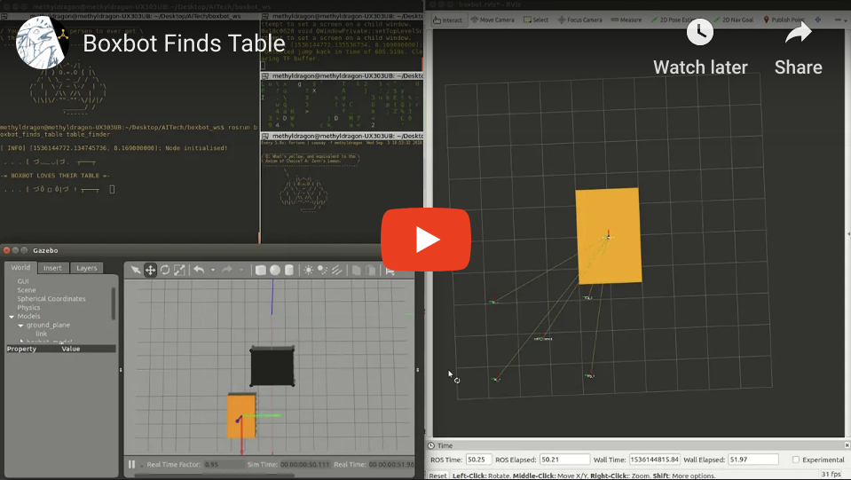

# boxbot_finds_table
ROS, Gazebo and C++ practice. Guide a Boxbot to find it's table! Boxbots love their tables!

[](https://youtu.be/bZ0u1Xh0dfA)

### Steps:

1. Create a new catkin workspace
2. Place the src folder into that workspace
3. Run `catkin_make`
4. Source the devel/setup.bash
5. Run `rospack profile`

Then run the following:

```shell
# Terminal 1
$ roslaunch boxbot_gazebo boxbot_world.launch

# If the navigation node crashes, run in Terminal 2
$ rosrun boxbot_finds_table table_finder
```

You may also use the `boxbot.rviz` configuration file to visualise the transforms!

```shell
$ rviz -d boxbot.rviz
```


### Notes

Gazebo bugs out sometimes and causes the cmd_vel from the table_finder node to go crazy and send nan and inf or nonsensical values. I have added assertions to catch these and end the node before they cause any damage to the Gazebo simulation.

If it crashes, restart Gazebo and try again!


CH3EERS!